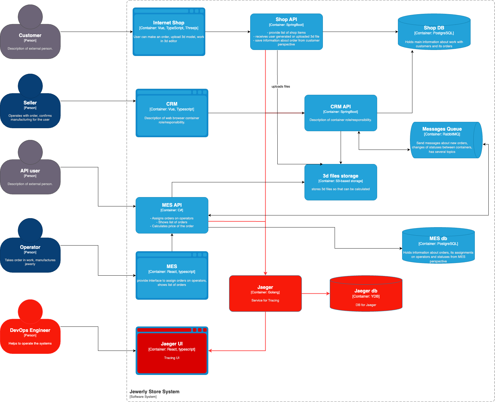

# 3. Трейсинг

## Мотивация

Основная мотивация - трейсинг поможет отследить на каком моменте теряются заказы через цепочку вызовов. Также, трейсинг поможет увидеть за какое время отвечают узлы приложения. Таким образом, при помощи трейсинга будет легче выявить узкие места и потерю заказов.

## Метрики

- Успешные заказы к неуспешным
- Время обработки заказа
- Время расчетов в MES

## Предлагаемое решение

Внедрить OpenTelemetry во все API: Shop, CRM и MES, а также настроить Jaeger для визуализации.

## Компромиссы

Пока сервисов не так много (не перешли в микросервисы), достаточно покрыть необходимый минимум в виде всех API. Но в дальнейшем было бы правильно подключить трейсинг во все сервисы.

Еще стоит учесть, что у команды может не быть опыта работы с трейсингом, стоит заложить время на обучение.

## Безопасность

Не писать в трейсинг чувствительные данные. Прятать пароли, маскировать и шифровать персональные данные.

Защитить вход в трейсинг только для поддержки, разработчиков и DevOPs.

