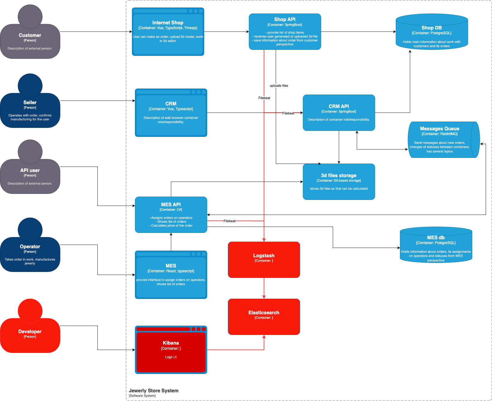

# 4. Логирование

## Мотивация

Чтобы разбирать ошибки не только со слов клиента:

1. Обнаружение и устранение проблем
Логи позволяют понять, что происходило в системе, когда и при каких условиях возникали ошибки или сбои. Это помогает быстро выявлять причины проблем и оперативно их исправлять.

2. Анализ и отладка приложений
Разработчики используют логи для поиска и локализации ошибок, а также для анализа производительности системы, что способствует повышению стабильности и надёжности программного обеспечения.

3. Повышение безопасности
Логирование фиксирует события, связанные с безопасностью - например, попытки несанкционированного доступа, изменения в правах пользователей. Это позволяет оперативно реагировать на угрозы и расследовать инциденты.

4. Мониторинг и контроль инфраструктуры
Логи дают возможность отслеживать состояние серверов, сервисов и приложений в реальном времени, что помогает предотвращать аварии и минимизировать время простоя.

5. Восстановление и расследование инцидентов
При сбоях или отказах системы логи выступают как «чёрный ящик», позволяя восстановить последовательность событий и выявить причины инцидента.

6. Анализ пользовательского поведения и бизнес-логирование
Логи помогают собирать статистику взаимодействия пользователей с системой, анализировать бизнес-процессы, строить метрики и улучшать качество обслуживания.

7. Оптимизация ресурсов и планирование
На основе логов можно выявлять узкие места в производительности, оптимизировать использование ресурсов и планировать масштабирование инфраструктуры.

## Предлагаемое решение

Логи будут реализованы на ELK стеке:

- Elasticsearch для поиска по логам
- Kibana для визуализации графиков
- Logstash для получения логов из разных источников
- Filebeat для доставки логов в Logstash

Нужно разобраться, что происходит с заказами.
Поэтому для начала лучше всего залогировать все API сопутствующие заказу.
То есть в качестве минимума: CRM API, MES API, Shop API.

Лог должен состоять из метки времени, сервис, id покупателя, номер (id) заказа, тип операции и ошибка если она есть. Главное обезличивать от персональных данных (маскировать пароли и закрывать часть ФИО символом астериска).

На уровень INFO можно логировать все движения по заказу статусы заказов:
INITIATED [онлайн-магазин] — пользователь завёл новый заказ или положил товары в пустую корзину.
FILE_UPLOADED [онлайн-магазин] — пользователь загрузил файл с 3D-моделью или создал его с помощью конструктора.
SUBMITTED [онлайн-магазин] — пользователь нажал на кнопку «Сделать заказ».
PRICE_CALCULATED [MES] — система посчитала стоимость заказа.
MANUFACTURING_APPROVED [CRM] — заказ подтверждён, его можно отдавать в производство.
MANUFACTURING_STARTED [MES] — оператор взял заказ в работу.
MANUFACTURING_COMPLETED [MES] — оператор выполнил заказ.
PACKAGING [MES] — оператор начал упаковывать заказ.
SHIPPED [MES] — заказ отправлен покупателю.
CLOSED [CRM] — заказ завершён.

Очень важно обложиь логами RabbitMQ - именно здесь может быть ошибка, связанная с тем, что заказы теряются.

Все перехваты ошибок (catch в блоке try), которые завершают сценарий - нужно залогировать уровнем ERROR.
На уровень WARNING можно подсвечивать обработку исключений по условию. (Например, retries).

Логи можно хранить в зависимости от уровня, например:

- INFO - 7 дней
- WARN - 14 дней
- ERROR - 30 дней

Чем выше уровень лога, тем больше храним, чтобы в случае ошибок - команда могла взять в задачу на отладку

В случае возникновения аномалий, например, если одинаковый запрос дублируется слишком много раз - стоит добавить счетчик и выдавать ошибки уровня ERROR. При приемлимом количестве, до 5 можно выводить WARN.
На массовые возникновения консистетных ERROR можно повесить алерты.
Нужно логировать также IP адресы, предполагать из этого фрод, ботов, а также черный список.

Команда должна реагировать на алерты - изучать логи. В команде можно выделить роль security champion, который будет добавлять задачи в разработку основываясь на периодическом изучении логов.
