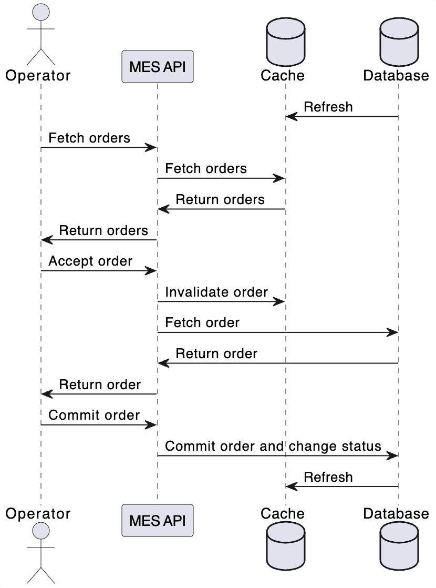

# Кеширование

## Мотивация

Кеширование должно решить следующие проблемы:

- Долгая загрузка страницы заказов
- Скорость работы выполнения заказа
- Уменьшение нагрузки на базу данных

## Предлагаемое решение

В интерфейсе MES можно также внедрить HTTP кеширование с быстрой инвалидацией (например, 30 секунд) на уровне заголовков (headers). Это снизит нагрузку, если операторы замотивированные деньгами будут часто перезагружать страницу, чтобы быстрее схватить заказ.

Использовать Redis на бекенде в режиме Cache-Aside. Реализовать его довольно просто, а также это будет быстрой точкой роста у бизнеса.

### Стратегия инвалидации

| Стратегия инвалидации | Подходит | Комментарий                                                                                                                         |
| --------------------- | -------- | ----------------------------------------------------------------------------------------------------------------------------------- |
| Временная             | Частично | Простая реализация, хорошо подходит для редко меняющихся данных, но может приводить к показу устаревшей информации.                 |
| На запросах           | Нет      | Инвалидация при каждом запросе и неправильной реализации - все равно создаёт высокую нагрузку и снижает производительность системы. |
| На основе изменений   | Да       | Позволяет быстро обновлять кеш при изменении данных, обеспечивает актуальность, но требует реализации событийной логики.            |
| Программная           | Да       | Обеспечивает точную и своевременную инвалидацию кеша, но сложна в реализации и поддержке из-за распределённой архитектуры.          |
| По ключу              | Нет      | Эффективна для отдельных элементов, но не обновляет агрегированные данные и списки, что может привести к рассинхронизации.          |

В нашем случае для быстрого внедрения выберем: программную инвалидацию вместе с временной. Как раз в нашем случае у заказа есть события, и временная инвалидация эффективно дополнит основную стратегию.

